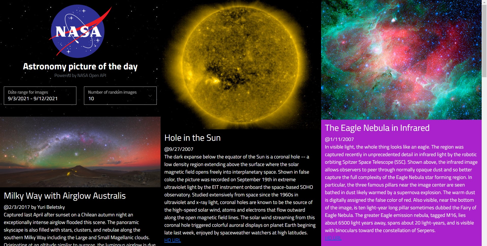

# OpenNasa.Apod
Blazor WebAssembly with Azure Functions app for Astronomy Picture of the Day powered by [NASA Open API](https://api.nasa.gov/).

## Getting started
0. Checkout the repository
1. Download Azure Functions CLI tools
2. Make sure Storage Emulator is started (its part of the .NET SDK)

### Multiple startup for Blazor app and Function app
- In Visual Studio configure the multiple project startup to run the Client and the Api
- In Visual Studio Code choose "Launch Functions and Debug Blazor WebAssembly App" debug configuration for multi-target debugging
- Or from CLI run `func start` from `src/Api` and then run `dotnet run` from `src/Client`
